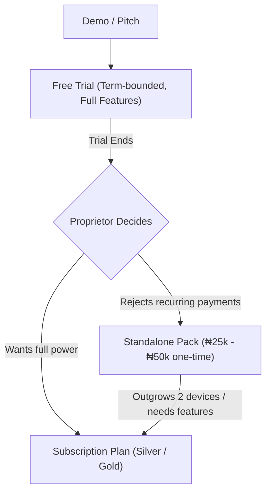

# 🧠 Field Notes: Honest Business Analysis (June 2026)

> *Written from field demo experience and direct school marketing. Not a plan — a set of observations to return to.*

### Context
The following analysis was discussed after several weeks of hands-on school demos in the Nigerian secondary school market. The Standalone Pack (Initiative 9) was born from this experience. These notes capture the honest strategic picture.

---

### On the Subscription Model — Are You Shooting Yourself in the Foot?

**Short answer: No. But you're fighting cultural gravity, and you need a bridge product — which the Standalone Pack is.**

The subscription objection from Nigerian schools is almost never about the price. ₦250/student/term for 300 students is ₦75,000 — most schools spend more than that on printer ink in a term. The real objection is **psychological: school administrators do not trust recurring software payments.**

This comes from three real fears:
1. *"What happens to my data if I stop paying?"* — A perfectly rational fear given the number of abandoned SaaS products in Nigeria.
2. *"I have no precedent for this."* — They buy computers once. They buy textbooks per-session. Monthly/termly software billing is alien.
3. *"The principal / proprietor won't approve this budget line."* — Internally, recurring software is hard to justify; a capital expenditure (one-time purchase) is easy.

**The Standalone Pack directly addresses fear #3.** It is a capital expenditure, not an operating cost. The moment a school admin can say *"we bought the software for ₦50,000"*, the conversation changes.

---

### On the Standalone Pack — Is It Smart or a Revenue Trap?

**It is smart IF you treat it as a sales motion, not a product.**

The risk is that schools buy the Standalone Pack and stay there forever. To prevent this:
- The 2-device limit must be felt. Schools that grow beyond 1–2 admin staff will hit it.
- The locked features must be visible, not hidden. The `🔒` sidebar items and the upgrade CTA in the Sync Hub serve this purpose — every time someone sees a locked feature, the subscription becomes more desirable.
- The `class_photo` template is a particularly effective hook: when the principal sees a report card with every student's passport photo, they will immediately want to show parents — which requires the Parent Portal — which requires Gold.

**The danger to avoid**: pricing the Standalone Pack so high that it becomes a destination rather than a stepping stone. Price it to close deals quickly (₦25k–₦50k range), not to maximise per-unit revenue.

---

### On the Teachers Screen for Standalone — Skip It

The Teachers screen in the current app (which manages teacher profiles and class allocations) is structurally redundant for Standalone users. Here's why:

- **Teacher allocation is the backbone of the subject-teacher sync model.** Without teacher-tied devices, there is no allocation to manage.
- **The only place teacher data surfaces in Standalone** is in printed report cards — specifically the "Form Teacher" comment field and the teacher's name/signature in the result header.
- **Both of those can be handled with static fields.** The report card template can use a "Class Teacher" text input instead of a lookup from the teacher registry. Or the field can simply be omitted from the Standalone template.

**Recommendation:** Hide the Teachers sidebar item for Standalone (same pattern as Attendance, Fees, etc.). The Print Hub config can offer a plain text "Form Teacher Name" field for report card purposes, removing the dependency entirely.

This also simplifies the UX: a school admin using the Standalone Pack does not need to think about "allocating" teachers to classes — there are no devices to allocate to.

---

### On the About Screen Upgrade Path — Gap Identified

**Current state:** The About screen has a "Current Plan" card with an "⚙️ Manage Plan" button that navigates to Settings. There is **no external upgrade URL** from within the app. The only external URL is `nexusos.com.ng/portal` (shown in the license lock overlay).

**For Standalone users**: The upgrade path should be explicitly present in the About screen and in every locked-feature touch point. Recommended addition:
- A second button below "⚙️ Manage Plan" labelled **"Upgrade to a Plan → "** that calls `shell.openExternal("https://nexusos.com.ng/portal")`.
- This one button closes the loop between the desktop app and the billing portal.

**For Standalone locked features**: The locked item tooltip should also include a tappable link to the portal. Currently the lock overlay shows `nexusos.com.ng/portal` as a support URL — it should be promoted as the primary upgrade action.

> Note: `nexusos.com.ng/portal` is the authenticated school admin portal with a live Paystack billing flow (`/portal/billing`). The page exists and works. The school just needs to be told to go there.

---

### On the Overall Strategy — Honest Take

The architecture of this product is genuinely strong for the market. The local-first, no-internet dependency is a significant moat in Nigerian secondary schools where network reliability is poor. The Ed25519-signed license is more robust than most edtech license systems in the country.

**Where the risk and adjustments are:**

1. **Redefining the Live Quiz System (High-Impact Demo Tool)**:
   - *Clarification*: The Live Quiz module is not a remote/online SaaS feature, but a **local, gamified classroom/hall event quiz** (digitized buzzers/contestant screens).
   - *How it fits*: A laptop projected on a hall screen/TV runs as the local server. Contestants scan a QR code via local Wi-Fi hotspot using their mobile devices/tablets. They tap answers on their screens, updating the main scoreboard in real-time during debates or social quiz hours.
   - *Business Value*: This is a **massive marketing demo hook**. Nigerian schools take competitive academic games extremely seriously, and showcasing this live setup during inter-house sports, open days, or school anniversaries instantly blows proprietors (and parents) away. It turns the software from a backend registry tool into a visible, premium, school-wide experience.
   
2. **Feature prioritisation**: While the Live Quiz has strong marketing value, prioritize the core value first: fast result generation, professional report cards, and basic mobile sync. Once the core results flow stably, the Live Quiz can be marketed as an premium add-on or a Gold-tier hook.

3. **The Standalone Pack must have a review/upsell cadence.** Without a deliberate "3-month check-in" call built into the sales process, schools will sit on Standalone indefinitely. Consider writing this into the onboarding process: the admin gets a follow-up call date during the handover.

---

### Upgrading from Standalone to Gold — The IDT Fee Dilemma

**The Question**: If a school buys the Standalone Pack for ₦25,000 and later decides to upgrade to the Gold plan (subscription), is it realistic to still charge them the full ₦150,000 IDT (Initial Deployment & Training) fee?

**The Reality**:
Yes, you *must* charge a setup/deployment fee, but charging the full ₦150,000 without adjustment will feel like a penalty to the school proprietor. 

- **Why you must charge**: Moving to Gold requires real labor. Standalone has no teacher training (it's admin-only, up to 2 devices). Gold allows up to 10 teacher terminals, which requires on-site training for 10 teachers. Gold also introduces the Parent Portal (distributing access slips, parents config) and the Financial Hub (bursar training). You cannot absorb this labor for free.
- **The Value-Offset / Rebate Strategy (Recommended)**:
  - Deduct the ₦25,000 they already paid for the Standalone Pack from the ₦150,000 Gold IDT fee.
  - Issue an invoice showing:
    - *Gold Plan Setup (Deployment, 10x Teacher Training, Parent Portal Launch)*: ₦150,000
    - *Less: Standalone Purchase Credit (Rebate)*: -₦25,000
    - **Total Due**: ₦125,000
  - *Why this works*: The proprietor feels they got their money back and didn't waste the ₦25,000. It makes the Standalone Pack a **zero-risk stepping stone** to subscription plans.
  - *Reframing the Fee*: Do not call it "setup fee". Call it the **"Teacher Masterclass and Portal Activation Fee"**. This communicates exactly what they are paying for (training 10 teachers + configuring parents/bursar).

---

## 🔐 Sovereign License Control — Discussion Notes (No Implementation Yet)

> *Ideas that came up during field experience. Documented here so they are not lost.*

### Idea 1 — Trial Licenses vs. Standalone (The Double Funnel)

**The concept:** Introduce **both** a Trial License and a Standalone Pack. They are not mutually exclusive; they form a cohesive conversion funnel.

- **Trial License (Time-Bounded, Free/Low-Cost)**:
  - *Purpose*: Hook the school. It replica-runs a subscription plan (e.g. Silver or Gold) but has a hardcoded expiration date (e.g. 30 days or 1 school term).
  - *Outcome*: The school gets teachers and parents actively using the app. Once the trial expires, the friction of losing the portal/whatsapp/teacher access is extremely high.
- **Standalone Pack (Feature-Bounded, Perpetual)**:
  - *Purpose*: The fallback product.
  - *Outcome*: If the school trial expires, and the proprietor absolutely refuses the recurring subscription model due to budget/psychology, you offer the **Standalone Pack (₦25,000 - ₦50,000)** as the fallback. 
  - They lose the teacher terminals, parent portal, and daily attendance (they are downgraded to 2 admin devices), but they keep the offline database and report card compiler. You recoup your acquisition costs, and they remain in your ecosystem.

**Double-Funnel Schema**:


**Implementation gaps to address later**:
- Write logic into the license generator for a `is_trial` boolean flag and a `valid_until` timestamp.
- Develop standard in-app notifications warning the admin: *"Your school trial expires in X days. Contact support to migrate to a plan."*

---

### Idea 2 — CBT Token Packs (Metered Feature Access)

**The concept:** Rather than including unlimited CBT exam sessions in the Diamond tier flat fee, sell CBT capacity as a consumable — a pack of exam sessions or candidate-tokens purchased separately.

**Why it makes sense in the Nigerian market:**
- Schools run CBT for external candidates (JAMB mock exams, pre-WAEC practice) as a revenue-generating service. They charge ₦3,000–₦8,000 per candidate.
- The school's willingness to pay Nexus scales directly with how many external exam sessions they run, not with their student count.
- A Diamond school with 200 students but a busy computer lab is worth far more than a Diamond school with 200 students that never uses CBT.

**The model that makes sense:**
```
Diamond plan: Includes N internal CBT sessions per term (for school's own students only)
External CBT sessions: Purchased as token packs from the billing portal
  - 100-candidate pack   → ₦X
  - 500-candidate pack   → ₦Y (discounted rate)
  - 1000-candidate pack  → ₦Z (enterprise rate)
```

**What the CBT session endpoint already documents:**
- `/api/cbt/tokens` (stub route) is documented as *"CBT-as-a-Service is NOT a token-pack sold by Nexus."* — This was the original design decision.
- That decision should be revisited. The pitch doc revenue example (₦800,000/month from a 40-seat lab) is the *school's* revenue. Nexus's share of that is currently ₦0 beyond the Diamond flat fee.
- A 1% or 2% session fee, or a flat pack model, captures Nexus's share of value created.

**What is needed to implement (future discussion):**
- A `CbtTokenPack` purchase flow in the billing portal.
- A `cbt_token_balance` field on the school's account, decremented per exam session deployed.
- The nexus-school app checks available token balance before allowing exam deployment.
- Sovereign dashboard shows each school's CBT consumption.

**The concern to address:** Schools will resist any per-session fee if they feel it is unbounded. Framing it as "packs you buy in advance" (like mobile data) is far more palatable than "you pay per exam" (feels like metering/surveillance).

---

*These are discussion notes. No code changes implied. Re-evaluate when Diamond plan revenue is being discussed seriously.*

